# Pixel Anime


Pixel Anime is a modern, responsive web application for streaming anime. With a sleek UI inspired by popular streaming platforms, Pixel Anime offers a seamless viewing experience for anime enthusiasts.

Built with React, TypeScript, and Tailwind CSS, this open-source project provides features like video streaming with subtitle support, user authentication, watch history tracking, and advanced search capabilities.

Powered by the <a href="https://api.consumet.org">Consumet API</a> for comprehensive anime data.

## 📺 Screenshot


## ✨ Features

- **Responsive Design**: Fully responsive UI that works on desktop, tablet, and mobile devices
- **Anime Catalog**: Browse through a vast collection of anime titles
- **Video Streaming**: Stream anime episodes with a custom video player
- **User Authentication**: Create an account, log in, and manage your profile
- **Watch History**: Keep track of what you've watched and continue where you left off
- **Search Functionality**: Find your favorite anime quickly with powerful search
- **Filters & Sorting**: Filter anime by genre, status, and more
- **Episodes Management**: Navigate through seasons and episodes easily
- **Adaptive Video Quality**: Automatically adjusts video quality based on network conditions
- **Subtitle Support**: Watch anime with subtitles in various languages

## 🚀 Tech Stack

- **Frontend**: React, TypeScript, Vite
- **Styling**: Tailwind CSS
- **Routing**: React Router
- **Video Playback**: HLS.js for HTTP Live Streaming
- **State Management**: React Hooks and Context API
- **API Integration**: Axios for REST API calls, Consumet API for anime data

## 🛠️ Installation

1. Clone the repository:
   ```bash
   git clone https://github.com/ChocoMeow/Pixel-Anime.git
   cd Pixel-Anime
   ```

2. Install dependencies:
   ```bash
   npm install
   ```

3. Create a `.env` file in the root directory with the following variables:
   ```
   VITE_API_BASE_URL=http://localhost:3000
   VITE_PROXY_BASE_URL=http://localhost:3001/proxy
   ```

4. Start the server:
   ```bash
   npm run start
   ```

## 🔧 Configuration

### API Integration

Pixel Anime uses [Consumet API](https://api.consumet.org) as the data source for anime information and streaming sources. Consumet is a free, open-source API that provides:

- Comprehensive anime metadata
- Episode information
- Video streaming sources
- Search functionality
- Genre filtering

You'll need to configure the `.env` file with the API endpoints:

- `VITE_API_BASE_URL`: The base URL for Consumet API (default: https://api.consumet.org)
- `VITE_PROXY_BASE_URL`: The base URL for the CORS proxy (if needed for streaming)

Note: If you're deploying to production, consider setting up your own Consumet API instance to avoid rate limits.

## 📋 Requirements

To run this project, you'll need:

- Node.js (v14.0.0 or higher)
- npm (v7.0.0 or higher) or yarn (v1.22.0 or higher)
- Modern web browser with JavaScript enabled
- Internet connection for API access

### Recommended Specifications
- At least 2GB of RAM for development environment
- 100MB of free disk space
- Operating Systems:
  - Windows 10/11
  - macOS 10.15 or higher
  - Ubuntu 18.04 or other modern Linux distributions

## 📝 License

This project is licensed under the MIT License - see the [LICENSE](LICENSE) file for details.

## 🙏 Acknowledgements

- [React](https://reactjs.org/)
- [TypeScript](https://www.typescriptlang.org/)
- [Vite](https://vitejs.dev/)
- [Tailwind CSS](https://tailwindcss.com/)
- [HLS.js](https://github.com/video-dev/hls.js/)
- [React Router](https://reactrouter.com/)
- [Font Awesome](https://fontawesome.com/)
- [Consumet API](https://github.com/consumet/api.consumet.org) - For providing anime data
